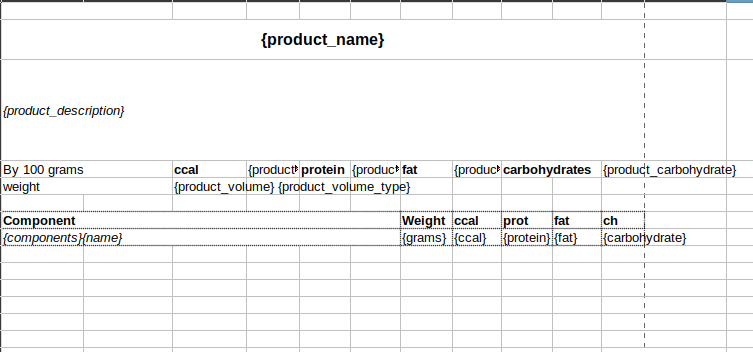

# xls-templating-php

### Install

`composer require nodasoft/xls-templating-php `

### Quick start
1. Create a template 
2. Write a generating code

```php

use NodaSoft\PhpXlsTemplating\ProcessOptions;
use NodaSoft\PhpXlsTemplating\SheetTplData;
use NodaSoft\PhpXlsTemplating\Templating;
$tplData = [
    'product_name' => 'Grandma\'s Lemon Meringue Pie',
    'product_ccal' => 12,
    'product_carbohydrate' => 5.2,
    'product_protein' => 2,
    'product_fat' => 5,
    'product_description' => 'This is a very fun recipe to follow, because Grandma makes it sweet and simple. This pie is thickened with cornstarch and flour in addition to egg yolks, and contains no milk.',
    'product_volume' => 123,
    'product_volume_type' => 'g',
    'components' => [
        [
            'grams' => 10,
            'name' => 'white sugar',
            'ccal' => 30,
            'carbohydrate' => 12,
            'protein' => 0,
            'fat' => 0,
        ],
        [
            'grams' => 50,
            'name' => 'cornstarch',
            'ccal' => 2,
            'carbohydrate' => 23,
            'protein' => 3.6,
            'fat' => 1.3,
        ],
        [
            'grams' => 250,
            'name' => 'egg whites',
            'ccal' => 50,
            'carbohydrate' => 7.8,
            'protein' => 30,
            'fat' => 4,
        ],
        ]
    ],
];

$options = new ProcessOptions();
$options->insertInsteadOfCopy = true;
$t = new Templating();
$t
    ->setTplFileName('../xlsx/product.xlsx')
    ->setResultFileName('product.pdf')
    ->setIsSendToBrowser(true)
    ->setOptions($options)
    ->run(
        [
            new SheetTplData('', $tplData),
        ], 
        'Tcpdf'); // Mpdf Dompdf
```
3. Download the result 

### Developing
##### Install packages
```bash
docker-compose build && docker-compose run cmd /usr/local/bin/composer update
```

#### todo
* fix formula's processing
* column hiding
* add comments (phpdoc)
* translate comments in English
* write the examples
* write the tests


#### Guide

##### Vars 

Set a value of a var:

```php
$tplData['foo'] = 'the best var\'s value';
```

Write template `{foo}` to a cell:


Run the templater and check a result:


##### Row multiply

```php
$tplData['rows'] = [
    [
        'var1' => 1,
        'var2' => 2,
    ],
    [
        'var1' => 10,
        'var2' => 20,
    ],
];
```

Cell template: 


The var `{rows}` should bep laced in the first column!

Result: 


##### Image function

Set the var with an image content or URL:

```php
$tplData['image_bird'] = 'here_is_content_of_image';
```

Put in a template in a cell:
`{IMG}{image_bird}{/IMG}`

The library will replace `{IMG}{image_bird}{/IMG}` with `here_is_content_of_image` and convert it in an actual image.

##### Row visibility operator
Vars:
```php
$tplData['foo'] = false;
```

Template: `{IFSHOWROW foo}`

A row contains the template will be hidden

##### Row height function
Vars:
```php
$tplData['foo'] = 12;
```

`{CHECK_HEIGHT=foo}`

Set line's height 12

##### Cell format function
Cell template: `{SETSTRING}` - set 'text' format to a cell.

##### Execution formulas
Vars:
```php
$tplData['formula1'] = '=A1+12*B2';
```

`{FORMULA}{formula1}{/FORMULA}`

##### Hide or show a text operator
Vars:

```php
$tplData['cond'] = false;
$tplData['foo'] = 'some text';
```

Cell template: `{IF cond}{foo}{/IF}`

Result: empty string

Vars:

```php
$tplData['cond'] = false;
$tplData['foo'] = 'some text';
$tplData['bar'] = 'some other text';
```

Cell template: `{IF cond}{foo}{ELSE}{bar}{/IF}`

Result: 'some other text'